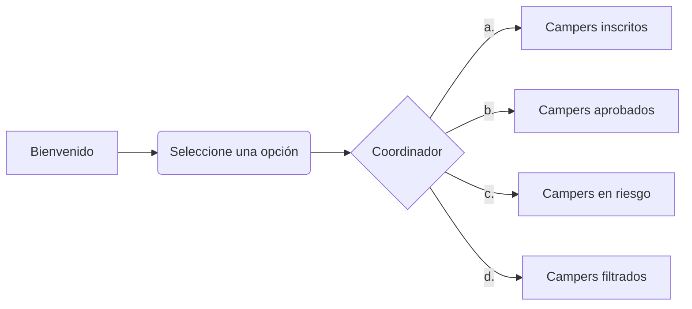
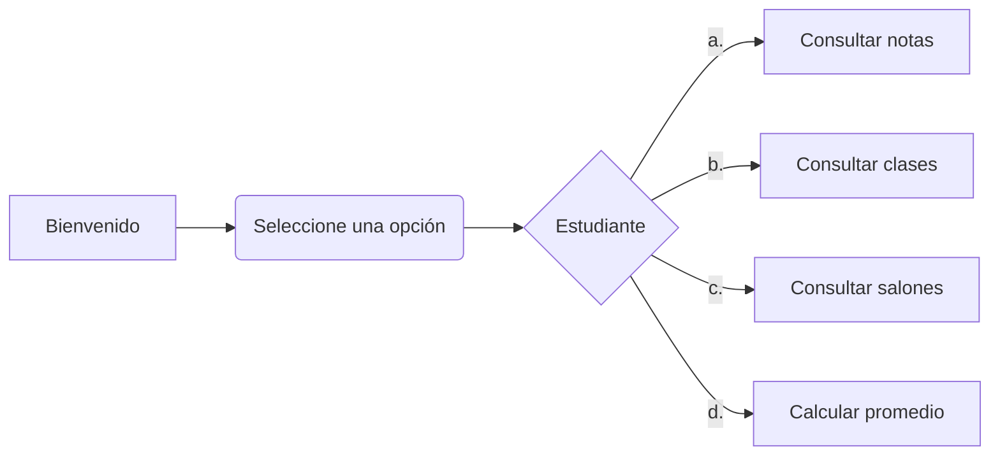

## Coordinación académica Campuslands
El siguiente proyecto fue desarrollado completamente en Python y funciona como una aplicación integral que puede ser empleada por alumnos, maestros y coordinadores de la institución educativa. 

 
## Características
-   Permite que los coordinadores tengan información detallada sobre el proceso de todos los campers.
-   Permite que los estudiantes consulten sus notas y asignaturas pendientes.
-   Permite que los maestros pueden publicar las notas y tareas.
-   Permite generar clasificaciones de los campers (inscritos, aprobados, en riesgo).

  
## Rutas de entrenamiento
-   Fundamentos de programación (PSeInt y Python)
-   Programación Web (HTML, CSS)
-   Programación formal (Java, JavaScript, C#).
-   Bases de datos (Mysql, MongoDb y Postgresql). 
-   Backend (NetCore, Spring Boot, NodeJS y Express).

